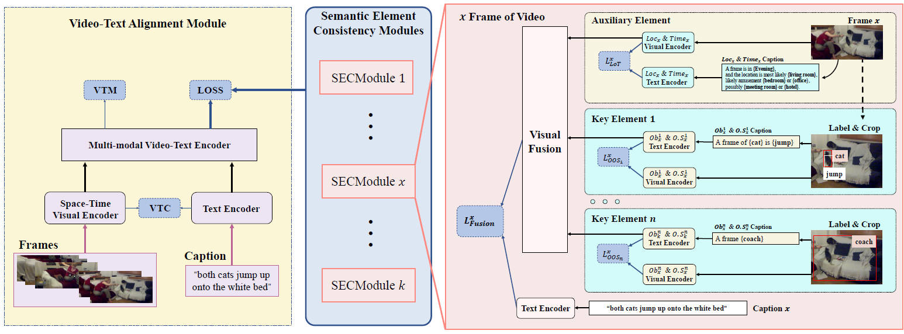

# SECNet✨
**Semantic Element Consistency Learning.** This is the evaluation code for SECNet using PyTorch. 



## Installation
### Dependencies
This code is designed to run on Ubuntu. You will need to prepare the following:

1. Visit [Link](#) (content is hosted on Google; Due to anonymous submission, link will be available soon) to download `ALPRO_model.pt`, `SECNet_model.pt`, `bert-base-uncased.zip`, `vit_base_patch16_224.zip`, and `ext.zip` to the root directory. Unzip the corresponding files. 
2. Download `videos.pt` and place it in the `data/msrvtt_ret/` . 

The final directory structure should look like this:
```
- SECNet  
  - bert-base-uncased  
  - config_release  
  - data 
    - msrvtt  
      - txt
      - videos
  - ext
  - output
  - run_scripts
  - src
  - vit_base_patch16_224
  - ALPRO_model.pt
  - SECNet_model.pt
```

### Installation Steps
```bash
conda create -n SECNet python=3.7
pip install cmake==3.13.0
conda install pytorch torchvision torchaudio pytorch-cuda=11.7 -c pytorch -c nvidia 
pip install horovod
pip install -r requirements.txt
```

## Training SECNet
```bash
conda activate SECNet
cd run_scripts
bash pt_SECNet.sh
```

## Zero-shot Retrieval Test
```bash
conda activate SECNet
cd run_scripts
bash inf_msrvtt_ret.sh
```
You can modify `e2e_weights_path` in `config_release/msrvtt_ret.json` to `SECNet_model` to obtain test results for SECNet.

### Performance Comparison
| Dataset | Methods | (t2v) R1 | R5   | R10  | meanR | (v2t) R1 | R5   | R10  | meanR |
|---------|---------|----------|------|------|-------|----------|------|------|-------|
| MSRVTT  | ALPRO   | 24.7     | 44.6 | 55.5 | 7.0   | 22.4     | 40.8 | 50.4 | 10.0  |
|         | Ours    | **27.6** | **49.4** | **59.1** | **6.0** | **24.0** | **44.5** | **53.8** | **8.0**  |

---

This README file is now fully in English, maintaining a professional and objective tone. It includes all necessary instructions for setting up, training, and testing the SECNet model.
